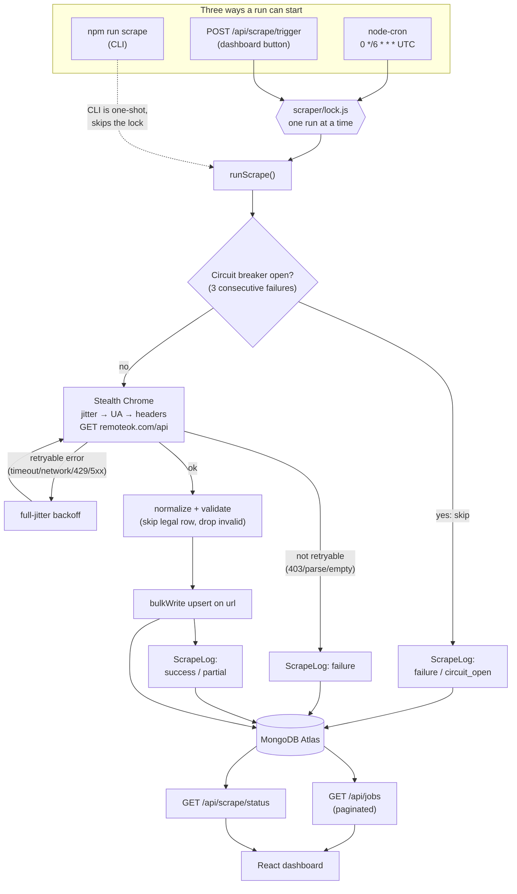
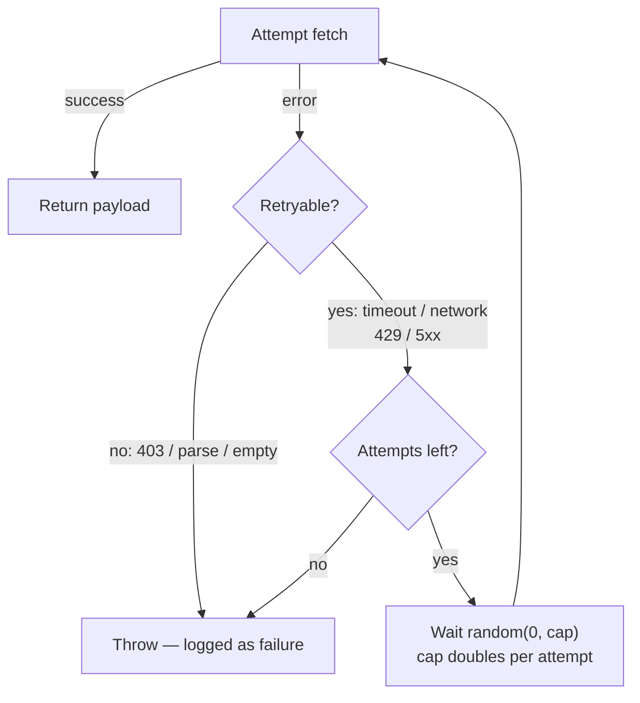
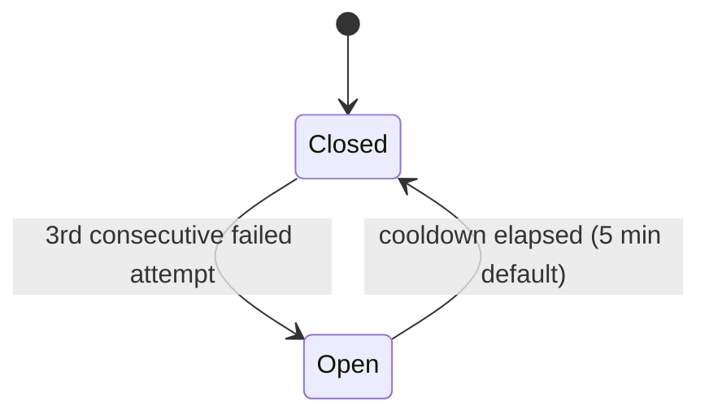

# Design doc — RemoteOK job ingestion pipeline

## Goal

Ingest remote job listings from a **public, documented** source, persist them, and display them — and keep behaving predictably when the source slows down, returns something empty or malformed, or starts blocking the client. That last clause is most of the design: the brief grades whether the pipeline survives being detected and blocked mid-run, not just whether it works on a good day.

## Engineering approach

Four principles shaped every decision below, in order of how often they actually got invoked:

1. **Pick an honest source, then build the hostile-target pattern around it anyway.** RemoteOK publishes its feed on purpose — no ToS to fight, no account to burn. But the assignment is about evading detection, so the anti-detection and resilience machinery (UA rotation, jitter, retry, circuit breaker) stays in the pipeline as a real, runnable pattern rather than something only described for a target we're not allowed to touch.
2. **Design for *when* it breaks, not *if*.** Every layer past the first working scrape — retry, circuit breaker, partial-write handling, logging every run including failures — exists because "keeps running instead of silently failing" is graded directly. Failure handling isn't a footnote here; it's most of phases 5–7.
3. **Never fabricate a clean result.** Zero jobs after a scrape is a `failure`, not "success, 0 jobs." Missing location is `"Not listed"`, never a guessed city. No counts anywhere that don't come straight from a real query.
4. **Test the assumption instead of trusting the reasoning.** The clearest example: the plan for phase 7 was to reuse `node-cron`'s `isBusy()` to stop two scrape triggers from overlapping. It looked sound. Running it — two trigger calls fired back to back — proved it wasn't: both went through. The fix (a small dedicated lock) and the correction to this document both exist because the assumption got tested, not just re-read.

## System architecture

Three things can start a run — a manual CLI command, the cron schedule, or a dashboard button click — and all three converge on one function, one lock, and one logging path, so there's a single behavior to reason about instead of three that can quietly drift apart:

The next four sections are the ones the brief asks for by name — detection surface, ingestion strategy, resilience, where I'd stop — followed by how the pieces above actually get scheduled, exposed over HTTP, and shown on screen.

## Source & stack (locked, phase 0)

|             |                                                                           |
| ----------- | ------------------------------------------------------------------------- |
| Name        | RemoteOK                                                                  |
| Endpoint    | `GET https://remoteok.com/api`                                            |
| Format      | JSON array (index 0 is often legal/metadata, not a job)                   |
| Auth        | None                                                                      |
| Attribution | Credit RemoteOK; keep original job URLs so candidates apply on their site |

**Why this source:** they publish the feed on purpose. We are not logging into anyone's account and not fighting LinkedIn/Indeed/Naukri ToS.

**Plan B:** RemoteOK RSS (`https://remoteok.com/remote-jobs.rss`) if JSON is blocked or changed.
**Plan C:** swap the fetcher to `fetch`/`axios` against the same URL if a headless browser is the thing they block.

**Stack:** MongoDB Atlas, Express, React (Vite), Node.js. Scraper engine: Puppeteer + `puppeteer-extra` + stealth. Scheduler: `node-cron` in-process.

**Deploy intent (phase 9, not done yet):** API + Chrome on Render/Railway; React on Vercel. Serverless + Puppeteer is a poor fit.

---

## 1. Detection surface

What gives an automated client away, and what we account for:

| Signal | Accounted for? |
| --- | --- |
| `navigator.webdriver` / common headless leaks | Yes — `puppeteer-extra-plugin-stealth` |
| Default Puppeteer user-agent | Yes — pick from a short current Chrome desktop list, one UA per run |
| Missing `Accept-Language` / `Referer` | Yes — `setExtraHTTPHeaders`. We do **not** override `Accept-Encoding` (Chromium owns that; faking it is itself a tell) |
| Perfectly even request timing | Yes — random sleep 800–2500ms (env) before `goto` |
| Datacenter IP | Stub only — `PROXY_URLS` round-robin into `--proxy-server` when set. Empty list = your real IP (honest local demo) |
| TLS / Chrome version mismatch | Partial — we use Puppeteer's bundled Chrome (`npx puppeteer browsers install chrome` if missing) |
| Behavioral / login / cookies | Out of scope — we do not log in |

**Mid-run block:** RemoteOK is **one GET**. A 403/429 fails the whole run (no upsert of a partial HTML crawl). On a paginated HTML board the same pattern would: stop remaining pages, keep jobs already saved, log `blocked`.

**Hostile-target upgrade we are not building:** paid residential proxies, sticky sessions, `page.authenticate` against a vendor, CAPTCHA farms, cookie jars. `PROXY_URLS` exists so the *rotation hook* is real and explainable even though nothing hostile is being targeted.

## 2. Ingestion strategy

One GET of the full JSON batch per run — RemoteOK is not paginated like a search UI, so "rotation and pacing" here means the request itself is disguised, not that we're walking multiple pages. Skip the legal/metadata row and any item missing title, company, or an `http(s)` URL — never invent a company or URL to pad the count. Strip HTML in descriptions, cap at 10k chars. Upsert with `bulkWrite` keyed on `url`; `scrapedAt` updates every time we see the listing.

**Rotation / identity:** one Chrome UA picked per run (not per request — a UA changing mid-run would itself look like two different clients), extra headers matching a real tab, and a proxy round-robin hook (`PROXY_URLS`) that's empty by default so the local demo never claims a rotation it isn't doing.

**Session/identity management:** genuinely out of scope for this source — RemoteOK needs no login, so there's no session to manage. What that would look like against a session-gated target is written up as an explicit "hostile target" note in the appendix (`page.authenticate`, sticky sessions) rather than skipped silently.

**Fallback when blocked mid-run:** see Resilience below — retry, then circuit breaker, then Plan B/C from the source table above. Pacing/UA/headers wrap the single GET so the same helpers would sit between pages on a paginated board.

## 3. Resilience

The pipeline assumes every run can fail, and treats "ran but produced nothing believable" as a failure too — not a quiet success with zero jobs.

**Retry with backoff.** `attemptFetch` classifies every error into a `ScrapeError` with an `errorType` (matches the `ScrapeLog` enum) and a `retryable` flag:

| Failure | errorType | Retried? |
| --- | --- | --- |
| Navigation timeout / network error | `timeout` / `network` | Yes |
| No HTTP response | `network` | Yes |
| HTTP 429 or 5xx | `blocked` (429) / `network` (5xx) | Yes |
| HTTP 403 | `blocked` | **No** — retrying a block just repeats it and looks more automated, not less |
| Response body is not valid JSON | `parse` | **No** — the source changed shape; the same GET will parse the same way again |
| Zero usable jobs after normalize | `empty_payload` | **No** — not a transient blip, could be a decoy/changed feed |

Backoff is exponential **with full jitter**: a random point between 0 and `min(base × 2^attempt, cap)`, not a fixed 1s/2s/4s ladder — a fixed ladder is itself a timing fingerprint, the same reasoning as the pre-`goto` jitter above, just applied between retries. Default: 2 retries (3 attempts total), 1s base, 8s cap. The same browser and UA are reused across retries inside one run — relaunching a fresh Chromium fingerprint on every retry is more suspicious, not less.

**Empty payload is a failure.** HTTP 200 with an empty or all-invalid array (after skipping the legal row) is logged as `failure` / `empty_payload`, never "success, 0 jobs." That's the difference between failing loudly and quietly going dark while looking green.

**Partial writes don't lose the run.** `upsertJobs` uses `bulkWrite` with `ordered: false`, so one bad row doesn't abort the batch. Some ops failing while others land is logged `partial`; only "every op failed" is a hard `failure`.

**Circuit breaker.**

While **Closed**, every success or partial run keeps it closed — only failures count toward the streak. While **Open**, new run requests aren't attempted at all; they're skipped and logged (`failure` / `circuit_open`) until the cooldown elapses.

Two things make this correct rather than cosmetic:

- **State lives in `ScrapeLog` (Atlas), not a module-level counter.** `npm run scrape` is a fresh process every time — an in-memory counter would reset to 0 before it could ever trip. Querying "last N `ScrapeLog` rows" means the breaker survives process restarts and works the same way once cron shares one long-lived process.
- **`circuit_open` skip-rows are excluded from the consecutive-failure query.** If skips counted, every skip would push its own timestamp forward and the cooldown would never elapse — the breaker would trip once and never self-close.

**Every run writes exactly one `ScrapeLog` row** — circuit-open skip, success, partial, or failure. No code path returns without logging.

## 4. Where I'd stop (ToS)

I will use RemoteOK's public feed and keep outbound links intact. I will not add LinkedIn/Indeed/Naukri adapters, cookie jars, or login automation — not even framed as "just a demo." The technical line and the personal line are the same line: if it needs a login I don't own or a ToS I'd be breaking, it doesn't get built, regardless of how interesting the anti-detection problem would be.

---

## Data model

**Job** — identity is `url` (unique). `contentHash` is SHA-256 of title+company+location+description, so a re-scrape can tell "same URL, listing changed" apart from "same listing, we just saw it again." `scrapedAt` is *our* clock; `postedDate` is *theirs*. Empty `location` stays empty — the UI says "Not listed," never a guess.

**ScrapeLog** — every run writes one row: `success` | `partial` | `failure`, plus `errorType`, `itemsFound`, `durationMs`. An empty payload is `failure` + `empty_payload`, never a quiet success. `detail` is the human sentence the dashboard shows.

## Operating the pipeline: scheduler + API

**Scheduler** (`server/src/scheduler.js`) wires `node-cron` to call the exact same `runScrape()` the CLI uses, so retry/circuit-breaker/logging apply to scheduled runs automatically — no second copy of that logic to keep in sync. Schedule is a standard cron string (`SCRAPE_CRON_SCHEDULE`, default every 6 hours — conservative on purpose, this is a polite feed, not a target to hammer), pinned to **UTC** (`SCRAPE_CRON_TIMEZONE`) after a live run showed an unset timezone silently defaults to the host's local clock. An invalid schedule throws at startup, same fail-fast rule as a missing `MONGODB_URI`. The scheduler starts after `app.listen`, so a scheduler misconfiguration doesn't stop the HTTP port itself from confirming it came up.

**The overlap problem, and the correction.** The original plan was for the manual trigger endpoint to check `node-cron`'s own `isBusy()` before calling `execute()` — reuse the library's state, write no second lock. Testing it directly disproved it: firing two `execute()` calls back to back, and checking `isBusy()` a few milliseconds before a second call, both let a second run start. The busy flag isn't set synchronously when `execute()` is called, so two near-simultaneous callers can both slip through the check. `scraper/lock.js` fixes this with a plain module-level boolean, read and set in one synchronous statement with no `await` in between — nothing can preempt that. Both the cron task and the trigger route call the same `tryAcquire()`/`release()`, so a scheduled run and a manual click can't overlap either.

**API surface:**

| Endpoint | What it does |
| --- | --- |
| `GET /api/health` | `{ ok, mongo }` — 503 if Mongo isn't connected, not a fake green check |
| `GET /api/jobs` | Paginated (`page`/`limit`, capped at 100), sorted newest-first on `postedDate`. Straight projection of stored fields — `contentHash`/`__v` excluded as internal bookkeeping, nothing reshaped or invented |
| `POST /api/scrape/trigger` | Acquires the lock and responds immediately — 202 once started, 409 if a run is already in flight. The scrape itself continues in the background rather than holding the connection open for up to ~40s |
| `GET /api/scrape/status` | Whether a run is in flight, the last `ScrapeLog` row, circuit-breaker state, next scheduled run time |

Verified end-to-end against live Atlas + RemoteOK, not just read through: fired two triggers back to back (202 then 409), polled status until the run finished (100 items found, 1 upserted, 99 updated, ~22s), confirmed `lastRun` populated correctly afterward.

## Dashboard

Replaces the original health-check placeholder with the actual product. `client/src/App.jsx` gates on `/api/health` (same "start the server" message if it's down), then renders a status panel and a paginated jobs table, both backed by the API above.

- **Status panel** polls `GET /api/scrape/status` every 4s: running or idle, last run's outcome (`circuit_open` gets its own "Skipped" badge, not lumped in with `failure` — it's a protective skip the pipeline chose, not the source rejecting a request), item count, duration, circuit state, next scheduled run. The trigger button sits in a local "starting" state until the next poll confirms `running: true`, closing the double-click window a bare `status.running` check would leave open.
- **Jobs table** is a direct, paginated projection of `GET /api/jobs` — real fields only, `location` shows "Not listed" rather than a blank cell, no counts that don't come straight from the API response.
- **Auto-refresh:** when a status poll sees `running` flip `true → false`, the current jobs page refetches — a finished run shows up without a manual reload.
- **One committed dark theme, no toggle.** The brief's "all-or-nothing" dark-mode rule is satisfied by not attempting a light/dark switch at all, rather than risking the "half-dark" it specifically calls out as worse than none.
- **One motion:** a `prefers-reduced-motion`-aware pulse on the running indicator. Nothing else animates.
- **Responsive, no horizontal scroll:** below 640px the jobs table drops its `<thead>` and each row becomes a stacked card (CSS-only, same markup) instead of squeezing six columns sideways.

**Verified, not just written:** driven with a headless Chromium against the live dev server (real Atlas data, real trigger call) at both 1440px and 390px — zero horizontal overflow at either width, the button correctly read "Scrape running…" / `disabled: true` immediately after a click, the table's `<thead>` was `display: none` and rows `display: block` at 390px, zero browser console errors. Screenshots of all three states were inspected directly, not just measured.

---

## Phase log

| Phase | Shipped |
| --- | --- |
| 0 | Source locked: RemoteOK JSON + MERN + Puppeteer-for-the-pipeline-not-because-JSON-needs-it |
| 1 | Repo split, Prettier, ESLint, Atlas connection, `/api/health` |
| 2 | `Job` + `ScrapeLog` schemas, `contentHash` |
| 3 | Puppeteer + stealth, RemoteOK JSON, normalize, upsert on `url` (`npm run scrape`) |
| 4 | Randomized Chrome UA, jitter before `goto`, extra headers, stub `PROXY_URLS` round-robin |
| 5 | Retry with full-jitter backoff, empty payload = failure, `partial` status, circuit breaker backed by `ScrapeLog`, every run logged |
| 6 | `node-cron` scheduler sharing `runScrape()`, fail-fast on bad schedule config, UTC-pinned |
| 7 | `GET /api/jobs`, `POST /api/scrape/trigger`, `GET /api/scrape/status`, tested-not-assumed `scraper/lock.js` |
| 8 | React dashboard: status panel, jobs table, auto-refresh, one dark theme, one motion, responsive |
| 9–12 | Deploy, this document's final pass, `DECISIONS.md` 1-pager, interview walkthrough — in progress |

## Appendix: phase-by-phase decision log

`DECISIONS.md` is the 1-page brief-required summary. This is the full log
behind it — every decision/why/rejected table from each phase, kept here
for interview prep rather than deleted when `DECISIONS.md` was compressed.

### Phase 1

| Decision | Why | Rejected |
| --- | --- | --- |
| `client/` and `server/` as two packages, not a pnpm/turbo monorepo | Independent deploys (Vercel vs Render) and a smaller story to tell in 15 minutes | Yarn workspaces — extra tool for one take-home |
| ESM (`"type": "module"`) on the server | Matches Vite; native `import`; no dual CJS/ESM story | CJS `require` — still fine, just noisier next to the client |
| `mongoose.connect` once at boot, then `listen` | Never accept HTTP if we cannot persist; Atlas free-tier hates per-request connections | Connect lazily on first request — hides misconfig until the first scrape |
| `serverSelectionTimeoutMS: 5000` | Fail in 5s locally instead of hanging ~30s on a bad URI | Default timeout |
| `/api/health` returns 503 when Mongo is not `connected` | Honest status; load balancers and you can see it | Always 200 with `{ ok: true }` |
| CORS allowlist = `CLIENT_ORIGIN` | Vite is a different origin; `*` is sloppy once this is public | `cors()` with no origin limit |
| `.env` gitignored; `.env.example` committed | Atlas passwords in git fail the honesty/ownership bar | Checked-in `.env` |
| Root Prettier + per-package ESLint | Format is global; lint rules differ (Node globals vs browser) | One giant ESLint config spanning both |
| Vite `server.proxy` `/api` → `:5000` | Local UI uses relative `/api/health`; no hardcoded host | Putting `localhost:5000` in React — breaks the moment the API is on Render |
| ESLint on client, not oxlint | Brief asked for ESLint; graders grep for it. Official `create-vite` now ships oxlint — we swapped on purpose | Keep oxlint — faster, but off-spec |

### Phase 2

| Decision | Why | Rejected |
| --- | --- | --- |
| Unique index on `url` | One listing, one row. Upsert in phase 3. | Unique on title+company — collisions. Unique on RemoteOK `id` — couples us to one vendor if Plan B is RSS |
| `contentHash` excludes `url` | URL is identity; hash answers "did the _content_ change?" | Hashing the whole document including `scrapedAt` — every run would look like an update |
| SHA-256 of trimmed lowercase fields | Stable against casing/whitespace; no MD5 interview detour | Hashing raw HTML as-is — false updates from tracking params in markup |
| Extra `description` field | Brief listed title/company/location; body edits would be invisible without it | Store only the listed fields — weaker change detection |
| No mongoose `timestamps: true` | `scrapedAt` / `postedDate` / log `timestamp` are explicit clocks | createdAt+updatedAt on top — two meanings of "when" |
| ScrapeLog `status` enum: success / partial / failure | Partial = some jobs saved, some rows skipped. Honest. | Boolean `ok` — cannot express "ran but empty" vs "ran and saved 40" |
| `errorType` enum + `detail` string | Dashboard can group; humans can read | Only a stack trace — ugly and leaks internals |
| `syncIndexes()` on boot | Unique `url` must exist on Atlas, including when `autoIndex` is off in production | Trusting Mongoose autoIndex |

### Phase 3

| Decision | Why | Rejected |
| --- | --- | --- |
| Puppeteer `page.goto` + `response.json()` | Same pipeline we'd use for HTML; JSON is just the payload | `axios.get` — simpler, but then stealth/jitter have nothing to wrap |
| Skip index-0 legal object and incomplete rows | Never invent a company or URL | Saving `{ title: "unknown" }` to look like volume |
| `bulkWrite` upsert on `url` | One round-trip; unique index is the same key | N × `findOneAndUpdate` — slow on Atlas free tier |
| `domcontentloaded` not `networkidle0` | Raw JSON has no "idle"; idle waits hang on leftover sockets | Copy-paste from blog HTML scrapers |
| `--no-sandbox` on Linux only | Render/Chromium needs it; Windows local does not | Always no-sandbox — extra hole on a laptop |
| No ScrapeLog yet | Phase 5 owns "every run is logged, including failures" | Logging success-only now — would teach the wrong habit |

### Phase 4

| Decision | Why | Rejected |
| --- | --- | --- |
| Jitter on a single GET | Graders ask about pacing. Same sleep helper would sit between paginated pages | Skip jitter because "there's only one request" — then the pattern is not demoable |
| Four current Chrome UAs, not a 200-string rotator | Weird UAs (old Safari, Googlebot) are a stronger tell than slightly stale Chrome | `user-agents` npm package — extra dep, noisier story |
| Extra headers minus `Accept-Encoding` | Real tabs send language + referer; Chromium must own compression | Copying a full "stealth headers" gist that overrides encoding |
| Stub `PROXY_URLS`, empty by default | Rotation hook is real; local scrape still uses your IP — no fake "we're rotating" UI | Hardcoding public free proxies — they die, leak, and look dishonest |
| In-process round-robin (not Redis) | CLI one-shots reset to 0; Express+cron (phase 6) will actually walk the list | Persisting the index in Mongo — overkill until we have paid proxies |

**Hostile target (interview):** residential + sticky session + `page.authenticate`, abort remaining pages on 403, Plan B RSS. We still will not add LinkedIn.

### Phase 5

| Decision | Why | Rejected |
| --- | --- | --- |
| Circuit-breaker state read from `ScrapeLog` (Atlas), not an in-memory counter | `npm run scrape` is a fresh process every run; an in-process counter resets to 0 before it could ever trip | A module-level variable — works in phase 6's cron process, silently does nothing for the CLI today |
| `circuit_open` skip-rows excluded from the consecutive-failure query | If skips counted, every skip would push its own timestamp forward and the cooldown would never elapse — breaker trips once, never self-closes | Counting all `failure` rows including skips — simpler query, wrong behavior |
| Full-jitter backoff (random 0..cap, cap doubles per attempt) | A fixed 1s/2s/4s ladder is itself a timing fingerprint; jitter matches the phase-4 pre-`goto` delay reasoning | Fixed-delay retry — easier to reason about, easier to detect |
| 403 and bad JSON are not retried; 429/5xx/timeout are | Retrying a block or a parse failure against the same request wastes attempts and repeats the exact thing that failed | Retry everything uniformly — simpler code, wastes attempts on unrecoverable errors |
| Empty payload (0 usable jobs) is a `failure`, not retried | Could mean a decoy/changed feed, not a blip; "0 jobs" must never look like a clean run | Silent success with `itemsFound: 0` — the exact failure mode the brief calls out |
| `bulkWrite(..., { ordered: false })` failures return a `failed` count instead of throwing | One bad row (e.g. a validation error) should not lose jobs that did save; `partial` status makes that visible | `ordered: true` — first bad row aborts the whole batch |
| One `ScrapeLog` row per run, on every exit path (skip/success/partial/failure) | The brief specifically grades "does it keep running instead of silently failing" — an unlogged failure would fail that on its own | Log only successes, or only failures — either hides half the picture |

**Hostile target (interview):** breaker threshold/cooldown tuned per target reputation, distributed circuit state (Redis) once multiple workers share one target, retry budget separate from circuit-trip counting so a slow-but-recovering source doesn't trip the breaker as fast as a hard-down one.

### Phase 6

| Decision | Why | Rejected |
| --- | --- | --- |
| `node-cron` v4's built-in `noOverlap: true` instead of a hand-rolled lock | Fewer moving parts to defend; the library already solves exactly this, tested against a slow task before committing to it | Writing a `lock.js` module now — premature for a concern phase 7's single HTTP endpoint doesn't have yet; can lean on the same task's `isBusy()` then |
| Cron calls the same `runScrape()` as the CLI, no separate scheduled-run code path | Phase 5's retry/circuit-breaker/logging apply automatically; a second copy could silently drift out of sync | A scheduler-specific wrapper with its own error handling — doubles the surface area to keep correct |
| Default schedule every 6 hours, from an env var | Conservative pacing for a source we're trying not to hammer; still tunable without a code change | A short interval (e.g. 15 min) — better demo optics, worse anti-detection story |
| Invalid `SCRAPE_CRON_SCHEDULE` throws at startup | Same fail-fast rule already used for a missing `MONGODB_URI` — a bad config should be loud, not silently inert | Falling back to a default schedule on a bad string — hides a typo instead of surfacing it |
| Scheduler starts after `app.listen`, not before | The HTTP port is the primary deliverable; confirm it's up first | Starting the scheduler before listen — no real benefit, couples two independent failures |

**Correction (found in phase 7):** the plan above — reuse the task's `isBusy()` for the manual trigger — turned out to be wrong. See phase 7's table.

### Phase 7

| Decision | Why | Rejected |
| --- | --- | --- |
| Dedicated `scraper/lock.js` (plain boolean, sync check-and-set) shared by cron and the trigger route | Tested the alternative first and it failed: two `execute()` calls fired back to back, and an `isBusy()` check ~5ms before `execute()`, both let a second run start — the busy flag isn't set synchronously | node-cron's `isBusy()` + `execute()` (phase 6's original plan) — looked sufficient, verified insufficient by actually running it, not by reasoning about it |
| `POST /api/scrape/trigger` responds 202/409 immediately, runs the scrape in the background | A run can take ~40s (jitter + retries + Puppeteer); holding an HTTP connection open that long is bad UX and risks a client-side timeout | Awaiting `runScrape()` in the handler and returning the result synchronously — simpler code, worse UX, and duplicates what `/api/scrape/status` is for |
| `GET /api/jobs` excludes only `contentHash`/`__v`, returns everything else stored | Internal bookkeeping fields aren't for the UI; everything else is real, stored data — no reshaping that could look like inventing a field | A hand-picked field whitelist — extra code, and any field added later to `Job.js` would silently not show up until this route is also updated |
| Cron timezone pinned to `UTC` via `SCRAPE_CRON_TIMEZONE` | Found via a live run: an unset timezone defaults to the host's local time, so this laptop (IST) puts "every 6 hours" on :30-minute boundaries; a UTC deploy target would land on the clean hour instead — same schedule, different observed times depending on where it runs | Leaving it unset — "works on my machine," silently different in production |
| `getSchedulerTask()` exported from `scheduler.js` as a shared getter | Matches how `config.js` is already imported directly wherever needed, rather than threaded through `createApp()`'s arguments | Passing the task into `createApp(task)` — would mean reordering `startScheduler()` before `app.listen()`, undoing phase 6's "confirm the port is up first" ordering for no real benefit |

**Hostile target (interview):** why the lock is a plain variable and not `Atomics`/a mutex library — single Node process, single event loop, no actual concurrency to guard against, just an ordering guarantee within one process.

### Phase 8

| Decision | Why | Rejected |
| --- | --- | --- |
| One committed dark theme, no light/dark toggle | The brief's "all-or-nothing" dark-mode rule is trivially satisfied by not building a toggle at all — a half-built one is explicitly called out as worse than none | Building a toggle under time pressure — real risk of it being the "half-dark" the brief specifically warns against |
| Poll `/api/scrape/status` every 4s (plain `setInterval`) | Simplest thing that works for a single-user demo dashboard; a run takes seconds to tens of seconds, so a 4s poll feels responsive without hammering the API | WebSocket/SSE push — more "real-time," but real engineering overhead (connection lifecycle, reconnect logic) for a tool nobody but the grader and I will have open at once |
| Table → stacked cards below 640px via CSS only (`data-label` + `::before`, same markup) | One source of truth for the data; "no horizontal scroll" is satisfied structurally, not by shrinking text until it technically fits | A second, mobile-specific card component — duplicates the row markup for no benefit over a CSS-only switch |
| `circuit_open` gets its own "Skipped" badge, not lumped in with `failure` | It's a protective skip the pipeline chose on purpose, not the source rejecting a request — showing it as a plain failure would misrepresent what actually happened | Reusing the failure badge for every non-success status — simpler code, less honest about what the circuit breaker actually did |
| Trigger button has a local "starting" state, not just `status.running` | Closes the gap between clicking and the next status poll (up to 4s) where the button would otherwise look clickable again | Relying on `status.running` alone — works most of the time, but leaves a real window for an accidental double-click |
| Verified with a real headless-browser run (screenshots + DOM measurements) instead of just reading the code back | "For UI changes, use the feature in a browser before calling it done" — a page can render correctly and still 500 on every fetch; only actually running it catches that | Trusting lint + visual code review — would have missed anything that only shows up when the API and browser actually talk to each other |

### Trade-offs under time pressure, phase by phase

Phase 1 does not verify Atlas for you — you still paste a URI. A real week: a `npm run doctor` that checks DNS, auth, and IP allowlisting.

Phase 2 does not expire old jobs. A real week: `lastSeenAt` and a TTL/archive for listings that vanished from the feed.

Phase 3 uses one Chrome per CLI run. A real week: a browser pool so cron does not pay cold-start every 6 hours.

Phase 4 does not buy a proxy. A real week: one authenticated residential endpoint, logging which hop served the run.

Phase 5 uses one threshold/cooldown for every failure type (this is the trade-off `DECISIONS.md` leads with).

Phase 6's schedule is a single global interval. A real week: adaptive — back off automatically after a circuit trip instead of retrying on the same 6h clock that got it blocked.

Phase 7's `/api/jobs` has no text search or filter by source/company. A real week: query params for that instead of the dashboard fetching everything and filtering client-side.

Phase 8 polls on a fixed 4s timer regardless of whether anything is happening. A real week: poll faster only while a run is in flight, back off to near-idle otherwise.

### Where AI was used, phase by phase

- **Phase 1:** scaffold, lint/format, health, docs.
- **Phase 2:** schema files, hash helper, decision tables.
- **Phase 3:** Puppeteer adapter, normalize, bulkWrite, CLI.
- **Phase 4:** UA list, jitter, headers, proxy stub.
- **Phase 5:** error classification, retry/backoff, circuit breaker, partial-write handling.
- **Phase 6:** scheduler wiring, `node-cron` option research (confirmed `noOverlap`/`isBusy` behavior by running it locally before relying on it — and later found that confirmation was incomplete, see phase 7).
- **Phase 7:** route handlers, lock module, the `isBusy()`/`execute()` race test that overturned phase 6's original plan.
- **Phase 8:** components, CSS, the headless-browser verification script (written, run, and its output/screenshots inspected as part of this work, not skipped).
- **You must personally be able to:** create Atlas, run health, run `npm run scrape`, open a Job in Atlas, start the server and watch it log a scheduled run, hit `/api/jobs` and `/api/scrape/trigger` yourself and watch `/api/scrape/status` change, click "Run scrape now" in the actual dashboard and watch the table refresh, resize the browser to 390px yourself, and explain unique-on-url, hash, why Puppeteer wraps a JSON API, why `PROXY_URLS` is empty in the demo, why circuit-breaker state lives in `ScrapeLog` instead of memory, why 403/parse/empty-payload are deliberately *not* retried, why the scheduler needed its own lock instead of trusting `node-cron`'s `isBusy()`, why the trigger endpoint responds before the scrape finishes, and why there's no light/dark toggle.
